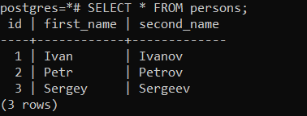

#### Создание ВМ

#### Подключение по ssh

#### Установка PostgreSQL

#### Создать 2 сессии и запустить psql из под юзера postgres

#### Выключаем автокоммит, создаем таблицу persons, заполняем ее значениями и смотрим на уровень изоляции - read committed Добавляем в 1-ой сессии новую запись, не делая коммит

#### Во 2-ой сессии делаем SELECT

#### Во 2-ой сессии записи при выборке нет, т.к. уровень изоляции read committed и пока изменения не закомичены, они не будут отображаться. Завершаем 1-ую транзакцию, запись появилась, т.к. изменения закоммичены

#### Переключить уровень изоляции на repeatable read и в 1-ой сессии добавить новую запись 

#### Сделать выборку во 2-ой, запись так же не отображается, т.к. на уровне repeatable read действует read committed

#### После коммита 1-ой, во 2-ой транзакции так же не отображается, добавленная запись, т.к. уровень repeatable read исключает возможность чтения изменений даже после коммита транзакции.

#### После коммита 2-ой транзакции, все изменения 1-ой стали видны.

