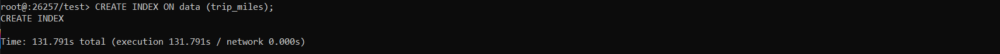

#### Развернуть CockroachDB в GKE или GCE. Потесировать dataset с чикагскими такси.
#### Разворачиваем инстанс CockroachDB и создаем тестовую бд

#### Загрузим в test 10ГБ данных - https://console.cloud.google.com/storage/browser/chicago10 
#### в среднем батчи по 250МБ на данной ВМ загружаются от 15 до 25 секунд

#### Протетируем выполнение запросов
##### COUNT

##### DISTINCT

##### GROUP BY

##### JOIN 

##### Добавим индекс на поле trip_miles

##### Запросы по индексу

