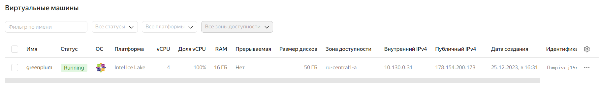
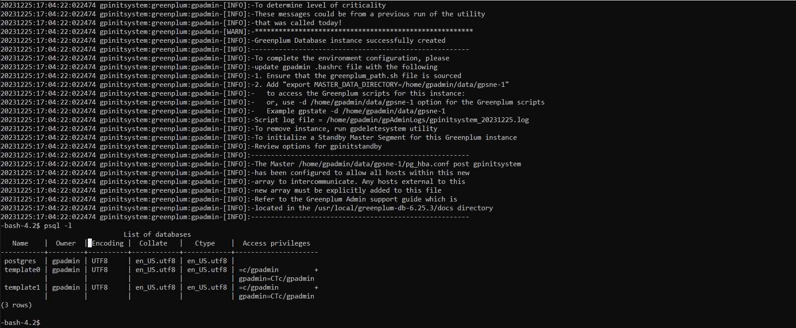
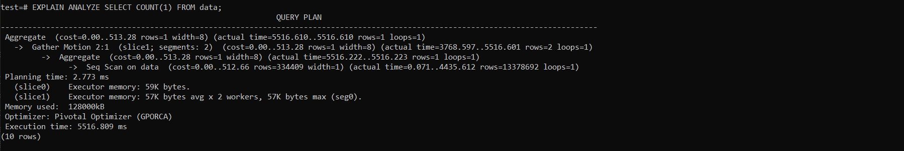
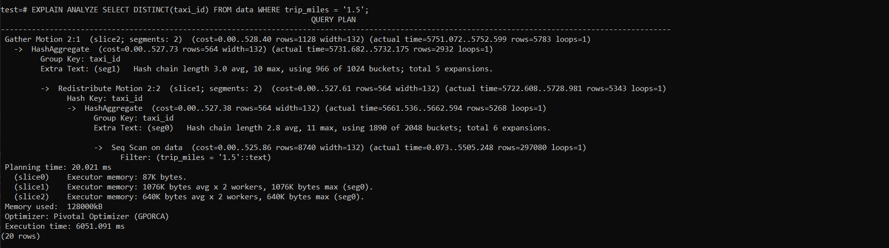
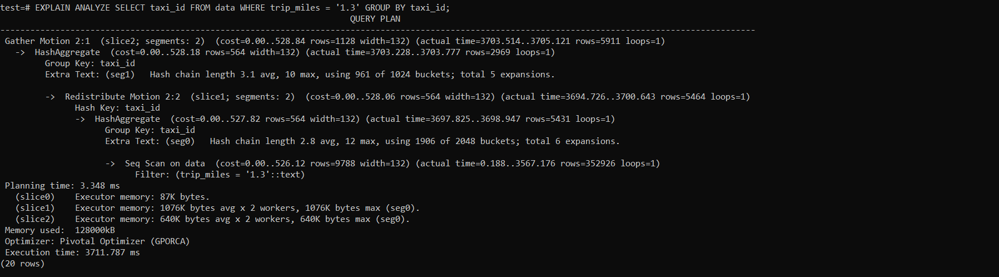
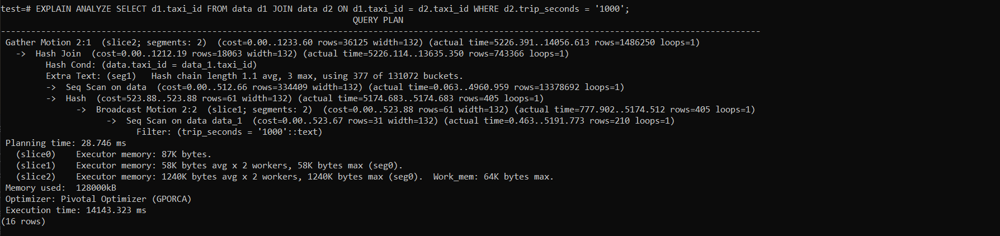
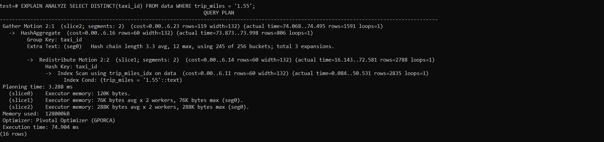
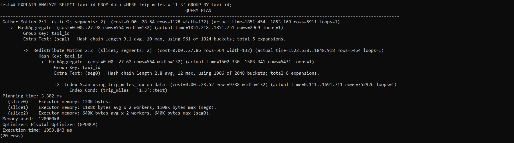
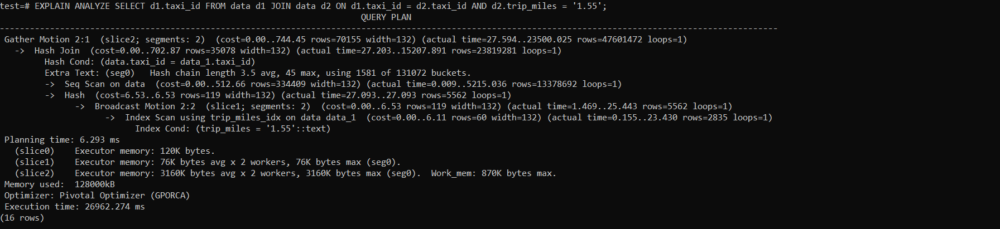

#### Развернуть Greenplum в GKE или GCE. Потесировать dataset с чикагскими такси.
#### Создаем ВМ, разворачиваем Greenplum и подключаемся

#### Создадим бд test и загрузим 10ГБ данных в таблицу - https://console.cloud.google.com/storage/browser/chicago10 

#### Протетируем выполнение запросов
##### COUNT

##### DISTINCT

##### GROUP BY

##### JOIN

##### Добавим индекс на поле trip_miles

##### Запросы по индексу

