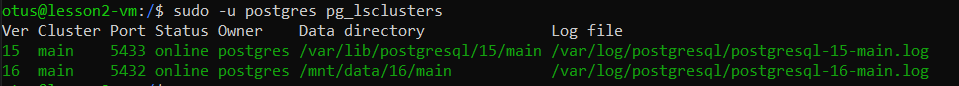
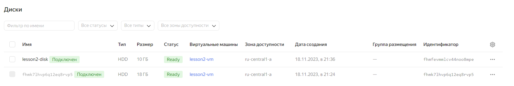
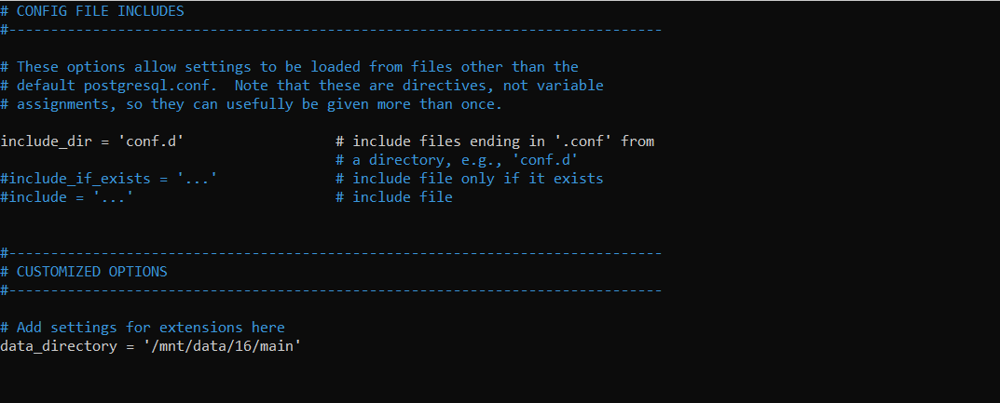
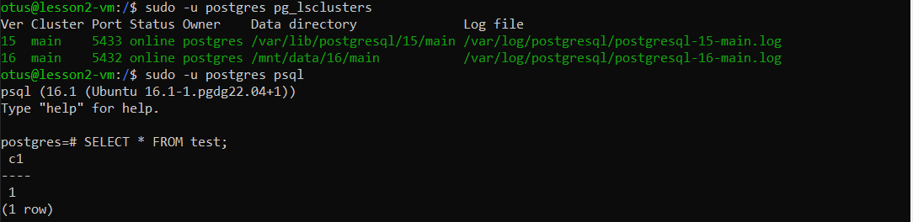
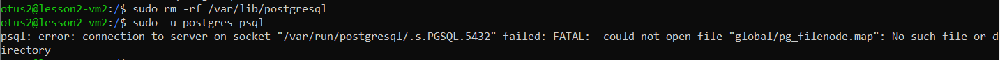
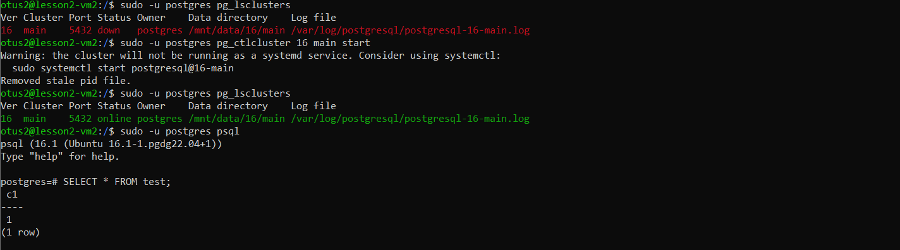

#### Создал и подключился к ВМ, установил и запустил PostgresQL 16

#### Зашел под пользователем postgres, создал таблицу test и заполнил ее

#### Остановил кластер postgres-a. Создал и смонтировал новый диск к ВМ

#### Перенес содержимое /var/lib/postgresql/16 в /mnt/data/

#### При попытке запустить кластер postgres-a возникла ошибка - "/var/lib/postgresql/16 is not accessible"

#### Т.к. каталог для хранения данных /var/lib/postgresql/16 перенесли в директорию нового диска, указал в файле postgresql.conf для параметра data_directory новую локацию.

#### Кластер успешно запустился, данные таблицы test остались целыми

### Со звездочкой *
#### Создал вторую ВМ

#### Установил на нее postgres и удалил директорию с данными /var/lib/postgresql

#### Перемонтировал внешний диск из первой ВМ ко второй

#### Добавил значение в конфиг для postgres-а на второй ВМ

#### Запустил кластер, проверил, что сохранилась таблица с данными, которую создавал в первой ВМ
