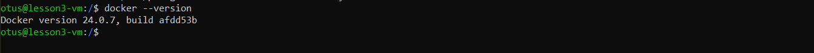
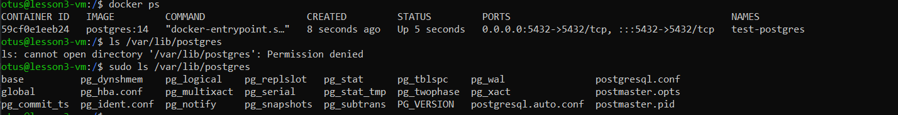
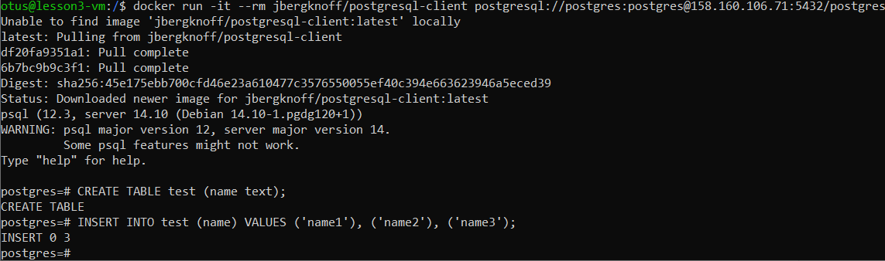
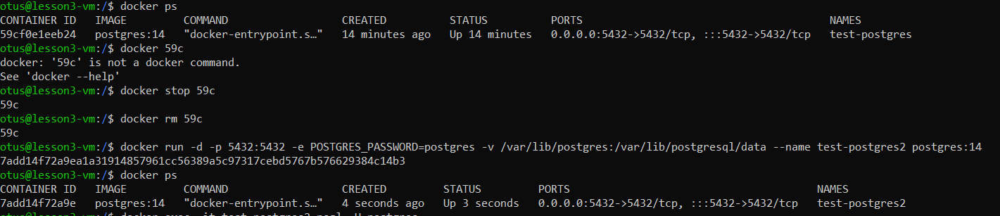
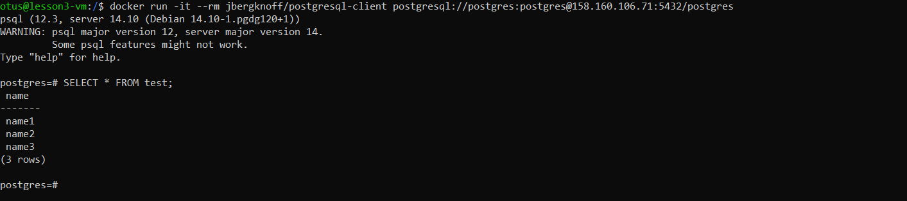

#### Создал ВМ, поставил Docker Engine

#### Создал каталог - /var/lib/postgres

#### Развернул контейнер postgres, смонтировал в него директорию /var/lib/postgres

#### Поднял контейнер с клиентом и добавил несколько записей в контейнер с сервером postgres-а

#### Удалил контейнер postgres и запустил заново

#### Подключился через клиент и проверил, что данные остались целыми
