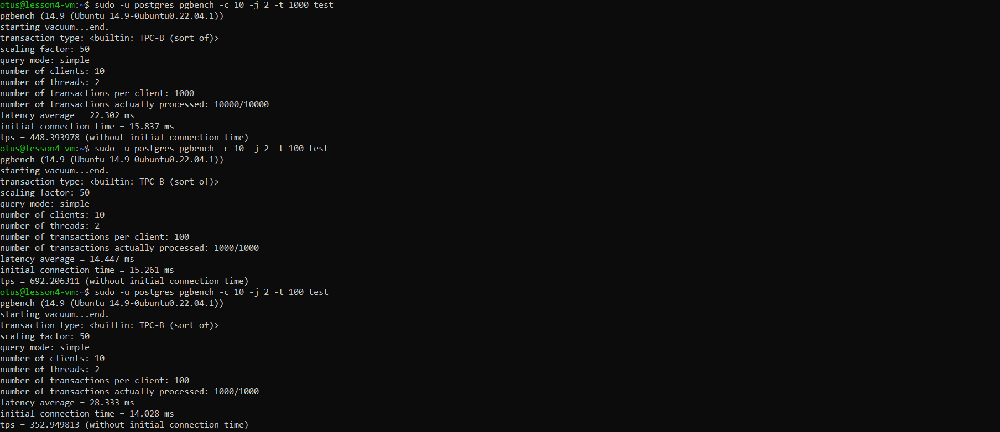
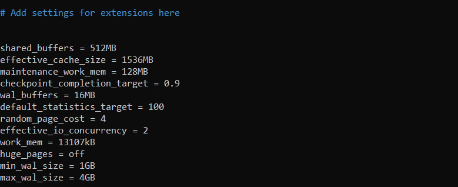

#### Подключился к ВМ, развернул PostgresQL
#### Протистировал pg_bench

#### Выставил отпимальные настройки в соответсвии с характеристиками ОС и версией Postgres

#### Количество транзакций в секунду увеличилось примерно в 2 раза
