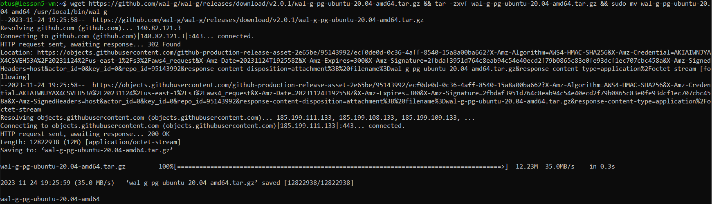
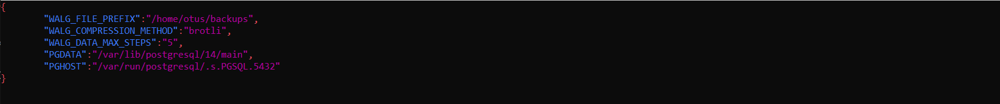
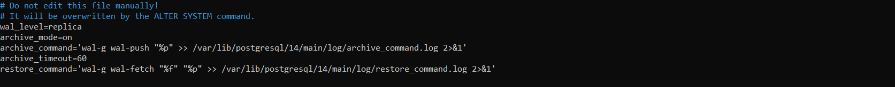
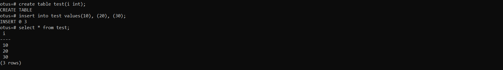
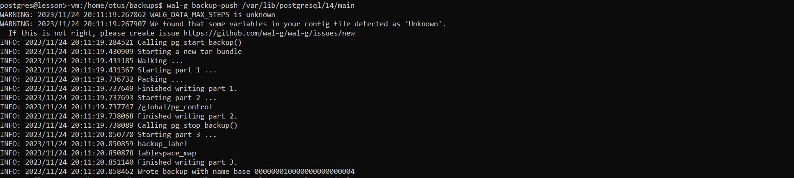
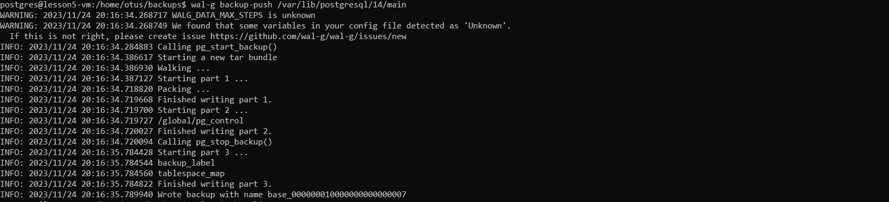
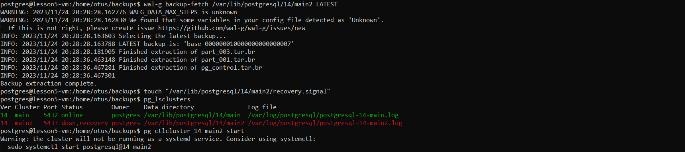
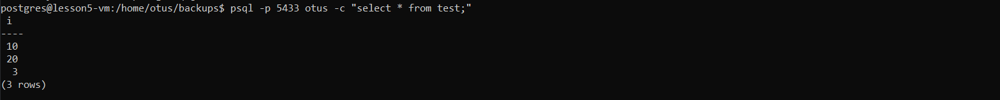

#### Поднял ВМ, поднял кластер postgres и установил wal-g

#### Создал файл конфигурации для wal-g

#### Настроил postgresql.auto.conf

#### Перезапустил кластер, заполнил базу данными

#### Сделал бэкап

#### Обновил данные, сделал delta бэкап 

#### Создал второй кластер, восстановил данные из бэкапа

#### Проверил, что данные на втором кластере восстановились
