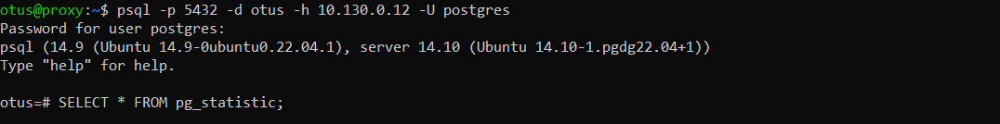

#### Создал 3 ВМ для etcd, сконфигурировал и запустил etcd

#### Создал ещё 3 ВМ для Postgresql и Patroni, установил на них Postgresql, проверил доступность нод etcd

#### Установил и сконфигурировал Patroni на всех ВМ

#### Создал еще 1 ВМ для HaProxy

#### Установил HaProxy, проверил, что доступ до кластера Postgres есть c 2мя сломанными нодами Patroni

