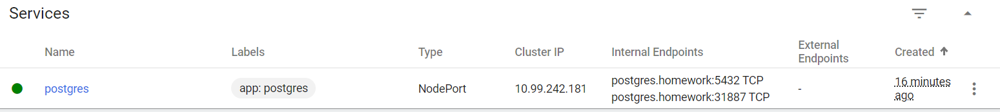

#### Разворачиваем PostgresQL 14 через manifest
##### Список манифестов (так же в папке /postgres):
##### ConfigMap
```
apiVersion: v1
kind: ConfigMap
metadata:
  name: postgres-config-map
  labels:
    app: postgres
data:
  POSTGRES_DB: otus
  POSTGRES_USER: postgres_admin
  POSTGRES_PASSWORD: postgres
```
##### Deployment
```
apiVersion: apps/v1
kind: Deployment
metadata:
  name: postgres
spec:
  replicas: 1
  selector:
    matchLabels:
      app: postgres
  template:
    metadata:
      labels:
        app: postgres
    spec:
      containers:
        - name: postgres
          image: postgres:14.0
          imagePullPolicy: "IfNotPresent"
          ports:
            - containerPort: 5432
          envFrom:
            - configMapRef:
                name: postgres-config-map
          volumeMounts:
            - mountPath: /var/lib/postgresql/data
              name: otus
      volumes:
        - name: otus
          persistentVolumeClaim:
            claimName: postgres-persistent-claim
```
##### PersistentVolume
```
kind: PersistentVolume
apiVersion: v1
metadata:
  name: postgres-persistent-volume
  labels:
    type: local
    app: postgres
spec:
  storageClassName: manual
  capacity:
    storage: 50Mi
  accessModes:
    - ReadWriteMany
  hostPath:
    path: "/mnt/data"

---

kind: PersistentVolumeClaim
apiVersion: v1
metadata:
  name: postgres-persistent-claim
  labels:
    app: postgres
spec:
  storageClassName: manual
  accessModes:
    - ReadWriteMany
  resources:
    requests:
      storage: 50Mi
```
##### Service
```
apiVersion: v1
kind: Service
metadata:
  name: postgres
  labels:
    app: postgres
spec:
  type: NodePort
  ports:
    - protocol: TCP
      port: 5432
  selector:
    app: postgres
```

#### Применил команду: kubectl apply -f postgres-config-map.yaml -f postgres-deployment.yaml -f postgres-persistent-volume.yaml -f postgres-service.yaml 
#### Созданные сущности



#### Проверил, что PostgresQL запустился и работает
