#### Сравнение скорости работы запросов в PostgresQL и Clickhouse при больших объемах данных

#### Запустил и развернул две ВМ с PostgresQL и Clickhouse
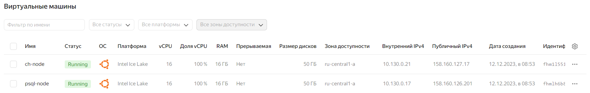

#### Для тестовых данных использовал датасет "Ошибки в энергетической системе" - kaggle datasets download -d lucasalex13/fault-in-electrical-power-systems, включает в себя 5 колонок: id ошибки, время длительности, 3 фазы
#### Загрузил данные в Clickhouse и PostgresQL размером 10 ГБ

#### Сравниваем скорость запросов в Clickhouse и PostgresQL
##### SELECT count(1) FROM data;
##### Clickhouse - запрос отработал за 0.002 сек.
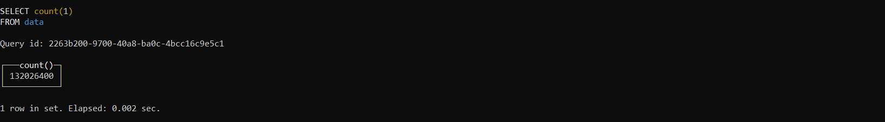
##### PostgresQL - запрос отработал за 4.8 сек.
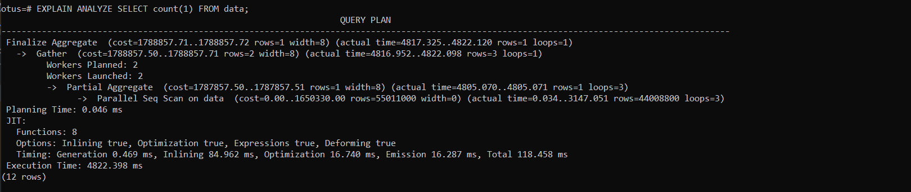
##### SELECT id_fault, SUM(time) FROM data WHERE time < 0.00001 GROUP BY id_fault;
##### Clickhouse - запрос отработал за 0.1 сек.

##### PostgresQL - запрос отработал за 2.17 сек.
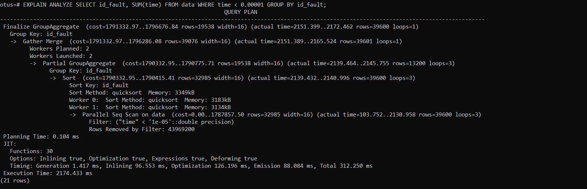
##### SELECT count(1) FROM data WHERE time < 0.0005;
##### Clickhouse - запрос отработал за 0.098 сек.
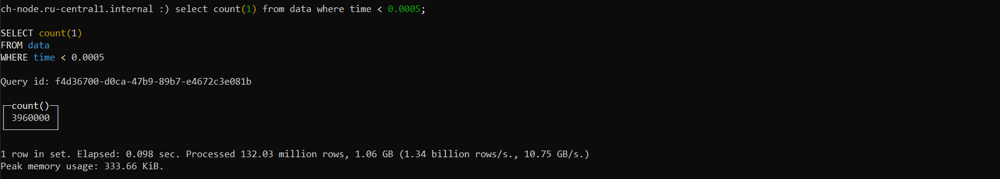
##### PostgresQL - запрос отработал за 2.3 сек.
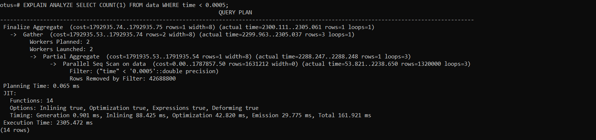
##### SELECT id_fault FROM data GROUP BY id_fault ORDER BY id_fault LIMIT 100000;
##### Clickhouse - запрос отработал за 0.074 сек.
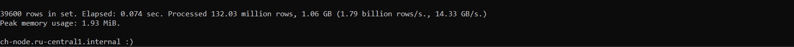
##### PostgresQL - запрос отработал за 7.16 сек.
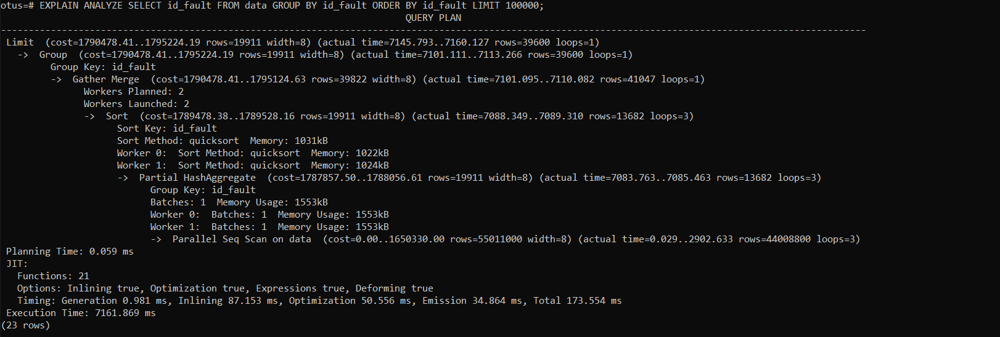
##### SELECT id_fault FROM data WHERE time > 0.5 AND s1 < 0.0 GROUP BY id_fault;
##### Clickhouse - запрос отработал за 0.079 сек.
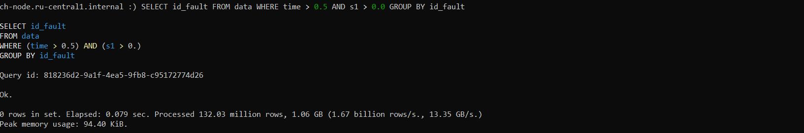
##### PostgresQL - запрос отработал за 2.18 сек.
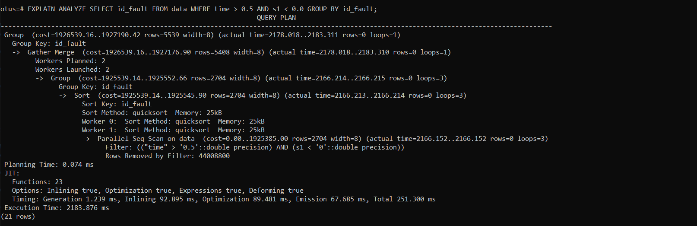
##### SELECT time FROM data GROUP BY time;
##### Clickhouse - запрос отработал за 0.079 сек.

##### PostgresQL - запрос отработал за 8.3 сек.
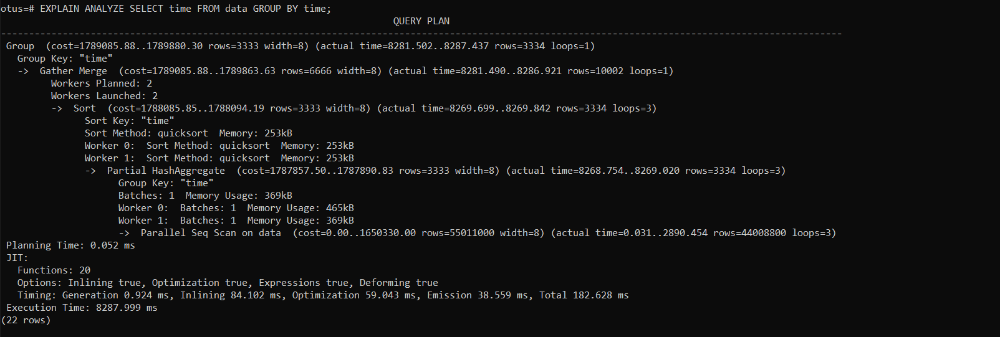

#### Таким образом при объеме данных в 10 ГБ на одинаковых по характеристикам ВМ (при оптимальных настройках postgresql.conf), запросы в Clickhouse отрабатывают примерно в 30 быстрее чем в PostgresQL