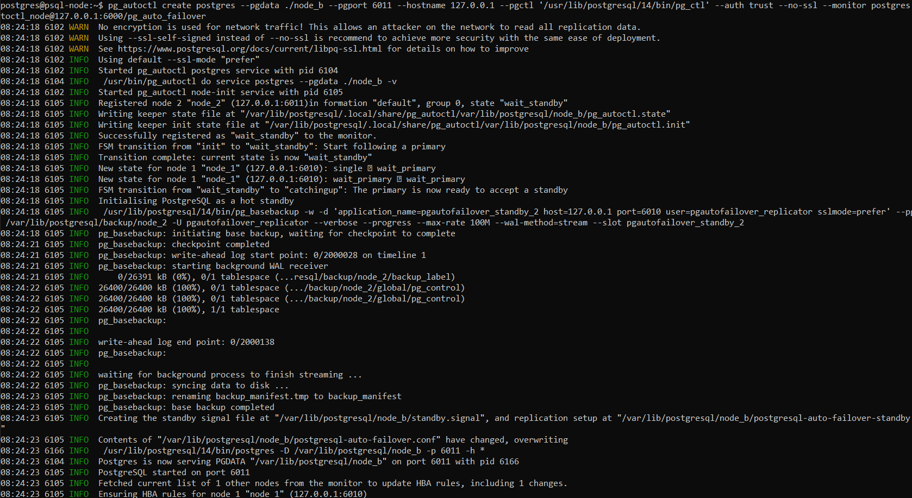
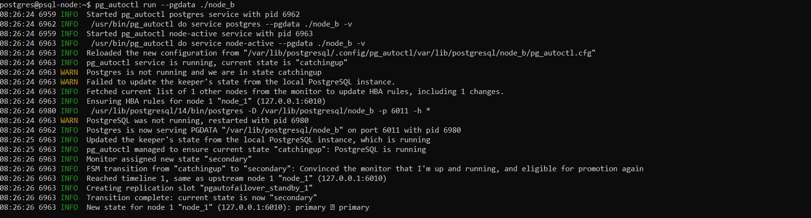
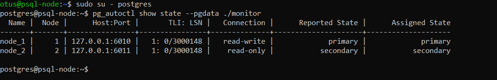

#### Разворачиваем высокодоступный кластер PostgeSQL с использованием pg_auto_failover

#### Introducing pg_auto_failover: Open source extension for automated failover and high-availability in PostgreSQL

#### Создал ВМ и установил pg_auto_failover с версией Postgres 14 

#### Создаем и настраиваем первый компонент - монитор. Он будет следить за состоянием нод постгреса.

#### Создаем времменную файловую систему с небольшим объемом памяти, для того что бы в дальнейшем симулировать аварию. И создаем Primary ноду Postgres-а.

#### Стартуем Primary на порту 6010 

#### Создаем Secondary ноду Postgres-a и запускаем на порту 6011

#### Смотрим что монитор видит состояние обеих нод 

#### Проверим, что все работает. Создадим таблицу и добавим туда данные в primary ноде и посмотрим, что реплика синхронизирована

#### Попробуем загрузить в дисковое пространство primary ноды файл большого объема и посмотрим, что произойдет

#### Теперь Primary нода помечена как demoted, а Secondary заняла ее место, если освободить дисковое пространство первой ноды, то нода которая была primary и demoted измениться на secondary и будет доступна только на чтение
